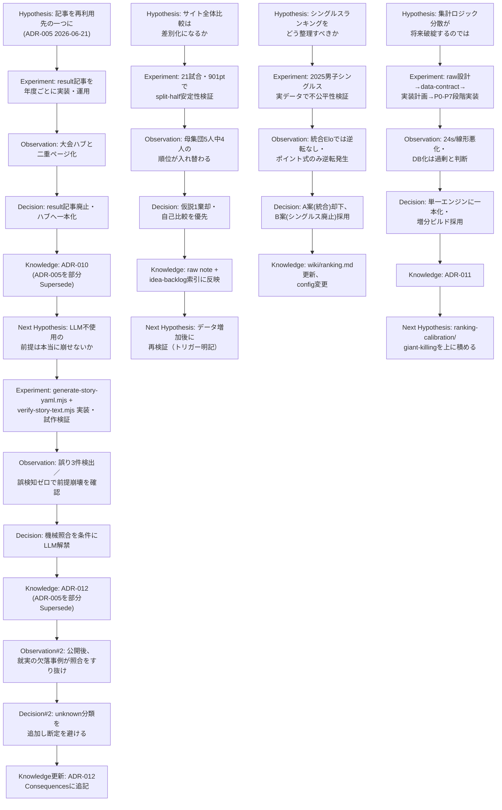

# AIDD探索循環・知識蓄積プロセス監査レポート

監査日: 2026-08-10
対象: softeni-pick リポジトリ（`docs/adr`・`docs/wiki`・`docs/raw`・`docs/prompts`・`AGENTS.md`・git履歴 全1835コミット、2025-04-18〜2026-08-09）

---

## 1. 結論（サマリー）

1. **このプロダクトは探索循環によって形成されていると言える。** `docs/raw`（仮説・生メモ）→ `docs/wiki`（知識化）→ `docs/adr`（重要決定の記録）→ 次の `docs/raw` という一方向ではない往復が、単発でなく繰り返し確認できる。しかも「文書がある」だけでなく、各文書間に具体的な参照リンクと日付があり、因果の連鎖を追跡できる。
2. **該当レベル: Level 5（探索循環が開発システムとして定着している）。** ただし「複数開発者の連携」ではなく「単一の人間（masahiro）＋複数のAIエージェント（Claude／Codex系ブランチが混在）」という編成での定着である点は割り引いて評価すべき（詳細は5節）。
3. **判断根拠**: (a) `AGENTS.md` が write-back・Compile Log・ADR Status運用を成文化した**運用ルール**として存在し実際に守られている、(b) `docs/prompts/`（`create-adr.md` / `update-wiki.md` / `review-docs-drift.md` / `summarize-raw.md`）という**繰り返し実行可能な監査手順**が存在し、実行結果（`docs/raw/2026-06-25-wiki-audit.md`, `docs/raw/2026-08-01-wiki-audit.md`）が実際に記録されている、(c) `scripts/check-tournament-insights.mjs` のように**CIビルドがドキュメント化された意思決定（ADR-012の検証条件）を機械的に強制**している、(d) 複数の仮説が実データで**棄却・撤回**され、その理由が消えずに残っている（4節・6節）。
4. **最も強い探索循環**: ADR-005（LLM不使用の文脈ブロック方針）→ 検証スクリプト実装 → 実データで前提が崩れたことを確認 → ADR-012（機械照合を条件にLLM解禁）→ 公開後に新たな見落とし（就実の事例）が発覚 → ADR-012本文に「機械照合は捏造を防ぐが集計ロジックの取りこぼしは防がない」という教訓を追記、という**二重の観察→決定サイクル**が単一のADR系列内に記録されている（6節 Cycle 2）。
5. **最も弱い部分**: プロセス自体のメタ探索（「AIとの共同探索の属人性をどう減らすか」）は `docs/wiki/open-questions.md` 上で**発散フェーズのまま中断中**（2026-07-11）であり、循環の主体（人間1名）自体の属人性は未解決。また Issue／PR ベースのレビューが存在せず、「他者による検証」を経た決定はない。
6. **現在失われている情報**: (a) 大量のfeatureブランチ（`codex/*`, `claude/*`, `feat/*` など40本超）がmainにマージされずに残っており、そこで行われた実験がADR/wikiに書き戻されたかどうかは個別に追わないと分からない。(b) 初期の設計判断（2025-04〜2025年前半のコミット群）はADR化以前の時期のため、なぜその設計にしたかの記録がない。
7. **次に改善すると循環が強くなる部分**: `docs/raw` に眠る「発散フェーズ・中断中」案件（例: open-questions.mdの属人性の問い、data-model.mdのKnowledge Graph案）に明示的な「再開トリガー」が書かれている案件とそうでない案件が混在している。全ての中断案件に再開条件を統一フォーマットで持たせると、次の探索への接続がさらに機械的に追跡可能になる。

---

## 2. 判定基準（本監査での適用）

設問の基本モデルに従い、各文書・コミットについて以下が同時に確認できて初めて「循環している」と判定した。

- 仮説（Hypothesis）: 「〜ではないか」という明示的な不確実性の記述があるか
- 検証（Experiment）: 実データ検証・実装・PoC・split-half検定などの具体的行為があるか
- 観察（Observation）: 検証の結果、仮説が支持／棄却／一部支持されたと明記されているか
- 意思決定（Decision）: 採用／不採用／方針変更が明記されているか
- 知識化（Knowledge）: ADR / wiki / raw の「Compile Log」等、決定が永続化されているか
- 次への接続（Next）: その知識が後続の別の意思決定・実装から参照されているか

単に「ADRが12本ある」「wikiが20ページある」ことは評価に含めず、上記6要素の連鎖が実際の記述として追えるものだけを「循環」としてカウントした。

---

## 3. 監査対象の構造

このリポジトリは監査に必要な役割分担が最初から明示的に分離されている点が特徴的である。

- `docs/raw/**`（69ファイル、2026-06〜2026-08）: 仮説・議論・実データ検証の生メモ。**追記専用**（`AGENTS.md`: "docs/raw は削除・上書きしない"）。
- `docs/wiki/**`（23ページ）: raw を実装と突き合わせて圧縮した現状仕様。`docs/wiki/idea-backlog.md` が全アイデアの状態（発散フェーズ／実装済み／棄却）を横断的に索引する。
- `docs/adr/**`（ADR-001〜ADR-012）: 後戻りコストの高い決定のみを記録。`Status`フィールド（Draft/Accepted/Deprecated/Superseded）で改訂履歴を追える設計。
- `docs/prompts/**`: `create-adr.md` / `update-wiki.md` / `review-docs-drift.md` / `summarize-raw.md` という、循環そのものを回すための**再実行可能な手順書**。
- `AGENTS.md`: 上記運用を強制するルール。「Compile Log」（rawのうちwikiに反映しなかった部分の理由を記録）を明文で要求しており、"検討した上で除外した"と"まだ確認していない"を区別可能にしている。

この構造自体は「循環している証拠」ではなく「循環するための足場」である。循環しているかどうかは、この足場が実際に使われた痕跡（4節・6節）で判定した。

---

## 4. 「失敗した探索」が残っているか

以下は撤回・棄却・不採用が明記され、理由まで追跡できた例。

| 案件 | 却下された案 | 理由 | 証拠 |
|---|---|---|---|
| 速報記事アーキテクチャ | result記事を`/news`配下に年度ごと量産する運用の継続 | 大会ハブと同一実体の二重ページ化（`seo.md` #8のカニバリ問題）が実際に発生 | ADR-010、未公開result 63件削除・公開5件を301リダイレクト |
| シングルスランキング | A案（singles/doubles統合の一本化ポイントランキング） | 統合Eloが既に役割を担っており重複。ダブルスの「今年一番のペア」を言えなくなる | `docs/raw/2026-07-11-idea-singles-ranking-retire.md` |
| 成長分析の見せ方 | サイト全体比較（偏差値的な相対順位表示） | 実データ検証（split-half安定性検定）で母集団5人中4人の順位が入れ替わり、統計的に意味のある差として検出できないと判明 | `docs/raw/2026-08-04-idea-growth-hint-self-vs-population.md` |
| LLM本文生成 | ADR-005時点での「LLM不使用」の全面維持 | 検証手段（`verify-story-text.mjs`）が実在するようになり「捏造を機械的に検出できない」という前提が崩れた | ADR-005→ADR-012の一部Superseded |
| 選手ページSEO | 姓頭文字での分割ページ生成 | 薄いページの量産になるため不採用 | `docs/wiki/players-pages.md`（players-pages Idea Backlog要約） |
| 全国大会の一次判定 | ランキングtier判定と表示上の「全国大会優勝」表記を同一基準にする | 用途が異なる（事実表明 vs 大会格の重み付け）ため意図的に二重基準のまま残すと決定 | `docs/wiki/open-questions.md`「全国大会」判定の二重基準 |
| 選手id分離 | 同姓同名を人物別idに分離する恒久対応 | 実測で対象30件・16名と少なく実害が限定的、id分離はURL・リンクへの影響が大きい | `docs/wiki/open-questions.md`「同姓同名の人物別id分離」 |

これらはいずれも「Bを採用した」で終わらず、「なぜAを捨てたのか」の実データ根拠（試合数・統計検定・実例の数値）が本文に残っている点が特徴。

---

## 5. 循環の強さ: Level 5 と判定した根拠、および留保

### Level 4までの充足

- Hypothesis → Experiment → Observation → Decision → Knowledge → Next Hypothesis の連鎖が、単一のADR系列内で**複数回**確認できる（ADR-005起点の3世代: ADR-005→ADR-010→ADR-012、6節Cycle 1・2）。
- `docs/raw/2026-07-01-player-statistics-engine*.md`（設計→データ契約→実装計画の3文書）→ ADR-011 → `docs/wiki/players-pages.md` という、設計討議が実装計画を経てADR化される一次資料の保全も確認できる。

### Level 5固有の要件（開発システムとしての定着）

- **CI/CDとの接続**: `scripts/check-tournament-insights.mjs` がprebuildに組み込まれ、ADR-012が定めた公開条件（`state==='published'` かつ `verifiedAt`）をビルド時に**再照合**し、1件でも不合格ならビルドを止める。ドキュメント上の決定がコードの強制力を持っている実例。
- **過去の失敗の再利用**: `docs/raw/2026-08-04-idea-growth-hint-self-vs-population.md` は `docs/raw/2026-07-11-player-style-profile-plan.md` の「母数が育つまで待つ」という教訓を明示的に参照し、同じ検証手法（表示ゲート・split-half）を再利用している。同じ失敗パターンを2度目は素早く検出できている。
- **ドリフト監査が実際に不具合を検出**: `docs/raw/2026-08-01-wiki-audit.md` は、`byeAdvanceToggle` のバグ（不戦勝同士の対戦が永久にエクスポートされない）をwikiと実装の突き合わせで発見し、「インターハイ2026女子ダブルスで70試合・70エントリーが欠落し、下流の大会インサイト記事が誤った断定をして取り下げになる実害」があったと記録。これは Observation → Decision（バグ修正・記事取り下げ）→ Knowledge（wiki修正）の循環がドキュメント監査という**メタ層**でも回っている証拠。

### 留保（Level 5を無条件に与えない理由）

- 開発者は実質1名（`git log --format=%an` で masahiro/mkojima系が全コミットの99%超）。「AI・人間・Git・ADR・Wiki・Issue・Prototype・CI/CD が連携」は確認できるが、「複数の人間」による相互レビューはない。GitHub Issue/PRのテンプレートも存在せず（`.github/`には`copilot-instructions.md`のみ）、決定はすべて単一人格＋AIの対話内で完結している。
- プロセスそのものへのメタ探索（属人性の低減）は`open-questions.md`で「発散フェーズ・中断中」のまま。システムが自己改善サイクルを回せているのは製品ドメインの決定に限られ、プロセス自体の改善循環は止まっている。
- 40本以上のマージされていないfeatureブランチ（`codex/*`等）があり、そこでの試行がADR/wikiに書き戻されたか個別確認できていない（＝raw化されていない実験が存在する可能性）。

以上を踏まえ、**「Level 5相当のシステムが機能しているが、単一オペレーターの範囲内」**という限定付きでLevel 5と判定する。

---

## 6. 実際の探索循環（5件）

### Cycle 1: 速報記事アーキテクチャの二重ページ化 → 廃止・ハブ集約

```
Hypothesis:
記事（preview/result）をイベント抽出の再利用先の一つとして持てば、
大会ページ・選手ページ・ランキングと並ぶ表示面として機能する（ADR-005、2026-06-21）。

Experiment / Prototype:
result記事を大会×年度ごとに実装・運用（zennihon-championship-2022〜2025-result等、4枚）。

Observation:
運用してみると、result記事が載せる「結果・優勝・歴代まとめ」は、
既に存在する大会ハブ（/tournaments/[generation]/[tournamentId]）とほぼ同じ内容で、
同一実体の二重ページ（seo.md #8のカニバリ問題）になっていた。

Decision:
result記事を廃止し、/newsはpreview専用にする。結果・優勝・歴代は大会ハブに一本化する。

ADR / Knowledge:
ADR-010（2026-06-27）。ADR-005の該当部分を明示的にSuperseded。

Next change:
未公開result 63件のJSON削除、公開済み5件を301リダイレクト、
generate-news-drafts.mjsのresultタイプ廃止。「ハブを歴代横断統計で強化する」という
Open Questionを残し、後続の大会インサイト機能（ADR-012）の掲載先選定
（「新規URLを作らずADR-010に抵触しない」）に直接影響した。

Evidence:
docs/adr/ADR-005-news-context-block-architecture.md,
docs/adr/ADR-010-retire-result-articles-consolidate-to-hub.md,
commit 1eb0c75b "feat: retire result articles and consolidate results into tournament hubs"
```

### Cycle 2: LLM不使用方針 → 検証ツール実装 → 解禁 → 公開後の見落とし発覚 → 教訓の追記

```
Hypothesis:
サイト本文にLLMを使うと誤情報混入を機械的に検出できないため使うべきでない（ADR-005前提）。

Experiment / Prototype:
決定的抽出スクリプト scripts/generate-story-yaml.mjs（LLM不使用）と、
生データ照合スクリプト scripts/verify-story-text.mjs を実装し、試作YAMLで検証。

Observation:
試作に紛れていた「もっともらしい」事実誤り3件（成績・連続年数の取り違え）を検出でき、
正しい投稿案には誤検知ゼロだった → 「LLMの捏造を検出できない」という前提が崩れたことを確認。

Decision:
機械照合を通ったものに限りLLM執筆の本文掲載を解禁する。ただしSNS限定案・人レビューのみ案は
実測（誤りは「もっともらしく」人レビューを素通りする性質だった）を理由に不採用。

ADR / Knowledge:
ADR-012（2026-08-01）。ADR-005の当該一点のみSuperseded。
公開条件はscripts/check-tournament-insights.mjsでprebuild時に再照合し強制。

Next change:
公開後、インターハイ2026女子ダブルスで「就実は勝ち残りが無くなった」という誤った断定を
機械照合が素通りさせる実例が発生（3組目が集計から黙って落ちていた＝集計ロジックの
取りこぼしで、照合できる主張の型に無かったため）。ADR-012本文のConsequencesに
「機械照合は捏造を防ぐが、集計ロジックの取りこぼしは防がない」と追記し、
生成側に「unknown」分類を持たせる設計対応につながった。この一連は
docs/raw/2026-08-01-wiki-audit.mdのドリフト監査で発見されたbyeAdvanceToggleバグ
（70試合欠落）とも接続している。

Evidence:
docs/adr/ADR-005, docs/adr/ADR-012, docs/raw/2026-08-01-wiki-audit.md,
commit b2ab5970 "インターハイ2026 女子 準決勝"
```

### Cycle 3: 成長分析「サイト全体比較」の実データ棄却

```
Hypothesis:
成長のヒントの見せ方として、自己比較(A)に加えサイト全体比較(B・偏差値的な相対順位)が
差別化・moatになり得るのではないか。仮説を0〜3に分解（前提→検出妥当性→知覚価値→事業インパクト）。

Experiment / Prototype:
public/data/beta-matches配下の全21試合・901ポイントの実データで仮説1（検出の妥当性）を検証。
表示ゲート（3試合以上）を満たす母集団が24人中5人しかいないことを確認した上で、
5人分のデータをsplit-half（時系列前半/後半）で順位を再計算。

Observation:
5人中4人の順位が入れ替わった（例: 1位→3位、2位→5位）。今この瞬間に順位を見せても
数試合の記録で順位が丸ごと入れ替わる可能性が高いことを実データで確認。仮説1を棄却。

Decision:
自己比較を「成長のヒント」の主力として先に育てる。サイト全体比較は保留し、
有料機能候補として温存。

ADR / Knowledge:
docs/raw/2026-08-04-idea-growth-hint-self-vs-population.md
（docs/wiki/score-general-availability.mdのIdea Backlog表に要約が反映され、
idea-backlog.md索引にも1行サマリが同期）。

Next change:
「記録ポイント数・対象選手数が今後増えたら再検証する」という再検証トリガー条件を明記。
仮説0（記録の手間）は別アイデア（記録半自動化）の射程として切り出し。

Evidence:
docs/raw/2026-08-04-idea-growth-hint-self-vs-population.md,
docs/wiki/idea-backlog.md（score機能 行）
```

### Cycle 4: シングルスポイントランキングの構造的不公平発見 → 廃止

```
Hypothesis:
種目区別（シングルス/ダブルス）のポイントランキングをどう整理すべきか
（統合する／カテゴリ分割する／シングルスのみ廃止する）。

Experiment / Prototype:
2025年男子シングルスの実データで検証。学生は自カテゴリ大会＋全日本シングルスの両方に
出場できるが一般/社会人は全日本シングルスの1大会のみという出場資格の非対称を確認。

Observation:
全日本シングルス優勝の社会人選手（上松俊貴）が、準優勝＋別大会優勝を合算した学生選手
（橋場柊一郎）より下位になる逆転が実際に発生。統合済みのElo（scripts/ranking/generate-ratings.mjs）
では同じ2選手の逆転が起きていないことも確認し、「実力推定では種目を分けない」判断は
既に別の仕組みで下されていたと分かった。

Decision:
A案（singles/doubles統合の一本化）は統合Eloとの役割重複を理由に却下。
B案（シングルスのポイントランキングのみ廃止）を採用。

ADR / Knowledge:
docs/raw/2026-07-11-idea-singles-ranking-retire.md
（docs/wiki/ranking.mdの仕様見直しに接続、config.ranking.disciplinesの変更として実装済み）。

Next change:
順位表JSONをdoubles限定で再生成、singles JSONを削除。残課題として
「シングルスのタイトル記録の導線」「統合Elo公開の判断」を後続の別スレッドに接続。

Evidence:
docs/raw/2026-07-11-idea-singles-ranking-retire.md
```

### Cycle 5: 選手集計ロジックの分散 → Player Statistics Engineへの一本化

```
Hypothesis:
選手ページ拡充のたびに集計ロジック（generate-player-analysis.mjs / careerRecord.ts /
milestones.ts / majorTitles.ts / tournamentRecords.ts）が分散し、解釈差・二重実装・
全大会再スキャンのコストが増え続けるのではないか。約8,200選手×405大会カテゴリの
全再計算はデータ追加が続くと破綻するのではないか。

Experiment / Prototype:
docs/raw/2026-07-01-player-statistics-engine.md（設計）→
同-data-contract.md（データ契約）→ 同-implementation-plan.md（実装計画）の3段階で設計を
固め、P0〜P7の段階実装（足場→L2純関数+単体テスト→ランキング生成→利用文脈配線→
移行/二重ロジック解消→増分ビルド）を実施。

Observation:
現状~24秒のビルド時間はデータ増に対して線形に悪化し、大半が無駄な再計算
（1大会追加の影響選手は数十名程度）であることを確認。DB化（SQLite/Supabase）は
入力が静的JSONでビルド時集計のみで足りるため運用コストに見合わないと判断。

Decision:
L0 SourceAdapter→L1 Facts→L2 Aggregators（純関数）→L3 Facade
（getPlayerStatistics()を唯一の公開APIにする）という単一エンジンに一本化。
manifestのcontentHashによる増分ビルドを採用。

ADR / Knowledge:
ADR-011（設計2026-07-01、実装完了2026-07-02）。
現状仕様はdocs/wiki/players-pages.md「選手統計エンジン」節に反映、
raw3文書は「歴史的記録として保全」と明記。

Next change:
P7前ハードニング（同姓同名/年度所属/同点順位への対応、commit 5605a029）、
ranking-calibration-harness・giant-killing検出など後続機能がこのエンジンの上に
段階的に積み上げられた（commit 62f9021c〜b02f2f90の一連）。

Evidence:
docs/adr/ADR-011-player-statistics-engine.md,
docs/raw/2026-07-01-player-statistics-engine.md / -data-contract.md / -implementation-plan.md,
commits 62f9021c, d5135b0a, 20865a68, 3665ba1b, 793c01fd, b02f2f90
```

---

## 7. 探索循環マップ（Mermaid）



---

## 8. Evidence Table

| Hypothesis | Experiment | Observation | Decision | Knowledge | Next Step | Evidence |
|---|---|---|---|---|---|---|
| 記事を文脈ブロックの再利用先の一つにできる | result記事を大会×年度ごとに実装・運用 | 大会ハブと同一実体の二重ページ化 | result記事廃止、ハブに一本化 | ADR-010 | 未公開63件削除・公開5件301、ハブ強化をOpen Questionに | ADR-005, ADR-010, commit 1eb0c75b |
| LLMは捏造を機械検出できないため使うべきでない | 決定的抽出＋生データ照合スクリプトを試作YAMLで検証 | 誤り3件検出・誤検知ゼロで前提崩壊 | 機械照合を条件にLLM解禁 | ADR-012 | prebuildで強制、就実事例発覚でunknown分類追加 | ADR-005, ADR-012, docs/raw/2026-08-01-wiki-audit.md, commit b2ab5970 |
| サイト全体比較（偏差値的順位）は成長のヒントとして機能する | 21試合・901ptでsplit-half安定性検証 | 母集団5人中4人の順位が入れ替わる | 仮説1棄却、自己比較を優先、再検証トリガー明記 | docs/raw/2026-08-04-idea-growth-hint-self-vs-population.md | データ増加後に同じ手法で再検証予定 | 同raw note, idea-backlog.md |
| シングルス/ダブルスのランキングをどう整理すべきか | 2025男子シングルス実データ＋統合Eloとの比較 | 統合方式は学生の二重出場資格で逆転を生む | A案(統合)却下、B案(シングルス廃止)採用 | docs/raw/2026-07-11-idea-singles-ranking-retire.md | config.ranking.disciplines変更・json削除 | 同raw note, wiki/ranking.md |
| 分散した選手集計ロジックは将来破綻する | raw設計→data-contract→実装計画→P0-P7段階実装 | 全再計算コストが線形悪化、DB化は過剰 | 単一エンジンへ一本化、増分ビルド採用 | ADR-011 | ranking-calibration-harness・giant-killingが上に積まれる | ADR-011, 3 raw docs, commits 62f9021c〜b02f2f90 |
| 大会途中経過はプレビュー記事の速報価値になる | normalize-core.jsのderiveEntryStanding切り出し・単体テストでparity確認 | 完了大会の出力は不変、途中大会でresults生成可能に | `rank.kind: 'ongoing'`を追加 | ADR-007 | newsArticle.tsのEntryStandingバッジ実装 | ADR-007 |
| 選手ページ集計の解釈は既存4ロジックのままでよいか | wikiドリフト監査でdata-import.mdと実装を突合 | byeAdvanceToggleバグで70試合・70エントリー欠落、下流insight記事が誤断定 | バグ修正＋wiki記述修正 | docs/raw/2026-08-01-wiki-audit.md | ADR-012のConsequencesに教訓追記 | 同raw note, ADR-012 |

証拠が確認できなかった仮説（推測で補完せず「証拠なし」とする）:
- ADR-004（成長分析の公開境界）の実際のユーザー同意運用が本番でどう機能しているかは、Draft状態のまま実測データが確認できず判断不能。
- 40本超の未マージfeatureブランチ個々における仮説検証の有無は、個別ブランチのコミット内容を精査していないため証拠なし。

---

## 9. 最後の問い: 計画実行型か、探索によって形を変えてきたのか

**分類: 継続的な知識循環型。**

根拠:

- 当初の実装方針（ADR-005の「本文はテンプレートのみ・LLM不使用」）が、後の技術的検証（`verify-story-text.mjs`の実装）によって覆り、ADR-012として明示的に上書きされている。これは「最初の計画をそのまま実行した」のではなく「探索で得た知識（検証手段が実在するようになったという事実）を次の意思決定に反映した」ケース。
- さらにADR-012自体も、公開後に得られた新しい観察（就実の欠落事例）によって、決定の本文はそのまま（Supersededにはしない）で Consequences に教訓を追記するという、より細かい粒度の循環を回している。
- シングルスランキングの廃止、result記事の廃止、サイト全体比較の保留はいずれも「最初にそう設計したから」ではなく、実データ検証・運用してみた結果の発見によって方針を変えた事例であり、当初計画の単純な実行ではない。
- 一方で、これらの循環はすべて`AGENTS.md`という**成文化されたプロセス定義**の範囲内で起きており、都度の思いつきではなく「raw→wiki→ADRという型」に沿って回されている。これは「部分的に探索型」を超えて、探索そのものが手順化・システム化されている状態と言える。

以上より、「最初に作った計画を実行している」でも「場当たり的に探索している」でもなく、**探索で得られた知識を成文化されたプロセスに沿って次の意思決定に体系的に反映し続けている**という意味で、継続的な知識循環型と判定する。

---

## 付録: 未検証・判断不能事項

- ADR-002・ADR-006・ADR-008・ADR-009・ADR-003の各ADRについても仮説→検証の記述はあるが、本レポートでは5サイクルの選定に含めなかった（証拠は`docs/adr/`内に存在するが、紙幅の都合で全12ADRの個別サイクル化はしていない）。
- git履歴のうち2025年前半（ADR運用開始以前）のコミット群は、意思決定の理由を記録した文書が存在しないため、探索循環の有無を判断不能とした。
